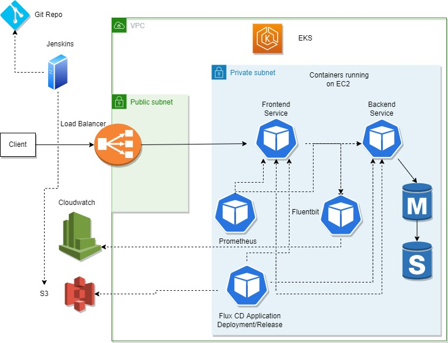

# 3TierApp
3TierApp with CI/CD and Infrastructure as Code

### Pre-requisites

- AWS Account
- Git Repo
- Jenkins for CI/CD Pipelines

### Architecture

### AWS Infrastructure
Infrastructure is maintained via Terraform and deployed as Jenkins Pipeline in AWS

### Applications
- Applications are deployed as containers in AWS EKS via Helm Charts with Flux CD
- Application deployment handled via Jenkins Pipeline

### Monitoring
- Prometheus is installed

### Logging
- Fluentbit is installed as Daemonset
- Application container logs are pushed to Cloudwatch
- Dynamic CW log groups will be created as per NAMESPACE/CONTAINER_NAME
